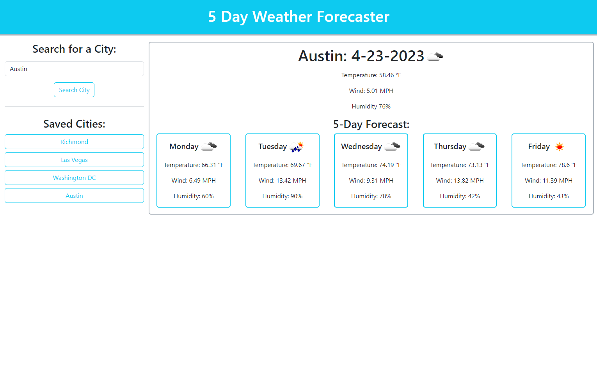

# 5-Day-Weather-Forecast-C6

## Description
In this challenge, we were tasked to create a weather forecaster when a city name was entered into a search field. When a user enters a city name, the current weather data for that city appears. In addition, the 5 day forecast appears. We did this using the openweathermap api to retrieve both the current weather as well as the 5 day forecast. Also, after a user has input a city name, it is added to the search history. If a button is clicked on in that search history, the current weather and 5 day forecast appears again. 

## Table of Contents

N/A

## Installation

N/A

## Notes for Future Development

* Return an error modal/notification to the user if the city name is not found or if the API returns an error
* Add a clear all history button to clear the user's search history
* If a city is typed in that is already in the search history, add code to check if that city name is already in the history. If it is, do not create a new button in the search history for it.

## Usage

Please follow the link below to the deployed application:

https://figgersrm.github.io/5-Day-Weather-Forecast-C6/

In order to clear the search history, local storage must be cleared.

## Credits

* CSS rest file: Eric Meyer https://cssdeck.com/blog/scripts/eric-meyer-reset-css/
* Bootstrap for styling on ther webpage: https://getbootstrap.com/docs/5.3/getting-started/introduction/
* OpenWeather for API calls to return weather data: https://openweathermap.org/api

## License

N/A

## Application Image

Below is an image of the deployed application:

